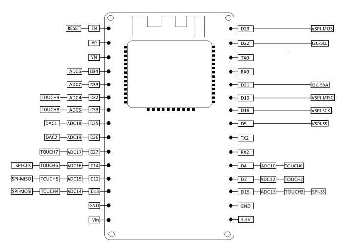
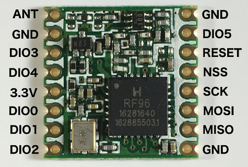

# Quick Start Guide

Get your LoRa gateway up and running in 5 minutes.

## What You Need

### Hardware
- **ESP32 board** (NodeMCU-ESP32)
- **RFM95 LoRa module** (868 MHz or 915 MHz)
- **USB cable** for programming
- **Antenna** for LoRa module (433 MHz for 868, 915 MHz for US)
- **WiFi access** to your network
- **MQTT broker** (Mosquitto, Home Assistant, etc.)

### Software
- **PlatformIO** (VS Code extension or CLI)
- **Home Assistant** (optional, for integration)

## Hardware Wiring

Default pin assignments (configurable in Config.h):

```
RFM95 Pin    →    ESP32 Pin (NodeMCU-ESP32 - GPIO numbers)
VCC          →    3V3
GND          →    GND
NSS (CS)     →    GPIO15 (D8)
RESET (RST)  →    GPIO2 (D4)
DIO0         →    GPIO0 (D3)
SCK          →    GPIO14 (D5)
MOSI         →    GPIO13 (D7)
MISO         →    GPIO12 (D6)
```

If using different pins, update `Config.h`:
```cpp
#define LORA_CS_PIN  15    // D8 - Chip Select (GPIO15)
#define LORA_RST_PIN 2     // D4 - Reset (GPIO2)
#define LORA_DIO_PIN 0     // D3 - DIO0 (GPIO0)
```

### NodeMCU-ESP32



### RFM95



## Step-by-Step Setup

### 1. Configure the Gateway

Edit `include/Config.h`:

```cpp
// WiFi
#define WIFI_SSID "YourWiFiName"
#define WIFI_PASSWORD "YourPassword"

// MQTT
#define MQTT_BROKER "192.168.1.100"    // Your MQTT broker IP
#define MQTT_PORT 1883

// LoRa Frequency
// 868000000 for Europe
// 915000000 for North America
#define LORA_FREQUENCY 868000000

// Pin configuration (NodeMCU-ESP32 board defaults - adjust if different)
#define LORA_CS_PIN 15     // D8 (GPIO15)
#define LORA_RST_PIN 2     // D4 (GPIO2)
#define LORA_DIO_PIN 0     // D3 (GPIO0)
```

### 2. Build and Upload

In VS Code with PlatformIO:

```bash
# Build the project
platformio run -e nodemcu-32s

# Upload to device
platformio run -e nodemcu-32s --target upload

# Open serial monitor
platformio device monitor
```

Expected startup output:
```
====================================
LoRa Gateway starting up...
====================================
Initializing LoRa... OK
Connecting to WiFi SSID: YourWiFiName
......
WiFi connected! IP address: 192.168.1.x
Connecting to MQTT broker at 192.168.1.100:1883
MQTT connected!
Gateway initialized successfully!
```

### 3. Verify LoRa Reception

Monitor the serial port to see when LoRa messages arrive:

```
LoRa message received from Node 1001, Device 0
```

### 4. Check MQTT Publishing

Using MQTT client (e.g., `mosquitto_sub`):

```bash
mosquitto_sub -h 192.168.1.100 -t "lora_gateway/#"
```

You should see discovery messages and state messages when nodes send updates.

### 5. Integrate with Home Assistant

Once nodes are discovered, devices appear automatically if Home Assistant MQTT integration is enabled.

**In Home Assistant `configuration.yaml`:**

```yaml
mqtt:
  broker: 192.168.1.100
  username: !secret mqtt_user
  password: !secret mqtt_password
```

Restart Home Assistant. Devices should appear under **Settings → Devices & Services → MQTT**.

## Creating Your First Sensor Node

See [NODE_IMPLEMENTATION.md](NODE_IMPLEMENTATION.md) for complete examples.

Quick temperature sensor example:

```cpp
#include <Arduino.h>
#include "LoRaHandler.h"
#include "Types.h"

// Adjust these pins for your specific microcontroller
LoRaHandler loRa(15, 2, 0);  // CS=GPIO15 (D8), RST=GPIO2 (D4), DIO0=GPIO0 (D3) for NodeMCU-ESP32

void setup() {
  Serial.begin(115200);
  if (!loRa.begin(868000000)) while(1);
  
  // Send announcement
  LoRaMessage msg;
  msg.nodeId = 1001;
  msg.deviceId = 0;
  msg.deviceType = DeviceType::SENSOR;
  msg.messageType = 0;  // Announcement
  msg.valueType = ValueType::FLOAT_VALUE;
  msg.value.floatValue = 0.0f;
  loRa.sendMessage(msg);
}

void loop() {
  // Send temperature every 30 seconds
  static unsigned long lastSend = 0;
  if (millis() - lastSend >= 30000) {
    lastSend = millis();
    
    LoRaMessage msg;
    msg.nodeId = 1001;
    msg.deviceId = 0;
    msg.deviceType = DeviceType::SENSOR;
    msg.messageType = 1;  // Sensor update
    msg.valueType = ValueType::FLOAT_VALUE;
    msg.value.floatValue = 23.5f;  // Replace with actual sensor reading
    loRa.sendMessage(msg);
  }
  
  delay(100);
}
```

## Troubleshooting

### Gateway won't connect to WiFi
- Check SSID and password in Config.h
- Verify WiFi network is 2.4GHz (ESP32 doesn't support 5GHz)
- Look for error messages on serial monitor

### MQTT not connecting
- Verify MQTT broker IP is correct
- Check MQTT broker is running
- Try connecting with MQTT client tool first: `mosquitto_sub -h <ip> -t '#'`
- Some brokers require authentication (add username/password to Config.h)

### No LoRa messages received
- Check pin wiring against Config.h
- Verify RFM95 module has power
- Check antenna is connected
- Verify frequency matches nodes (868 vs 915 MHz)
- Try putting modules close together (< 1 meter)

### Nodes don't appear in Home Assistant
- Confirm MQTT integration is enabled in HA
- Check that nodes are sending messages (see gateway serial output)
- Verify discovery messages on MQTT: `mosquitto_sub -h <broker> -t 'homeassistant/#'`

### Commands not received by nodes
- Check node is subscribed to command topic
- Verify topic format matches: `lora_gateway/node_{id}/device_{id}/command`
- Try publishing manually: `mosquitto_pub -h <broker> -t lora_gateway/node_1001/device_0/command -m '{"command":"ON"}'`

## Next Steps

1. **Multiple Sensors**: Create more nodes with different sensor types
2. **Advanced HA Integration**: Set up automations and scenes
3. **Battery Monitoring**: Implement deep sleep for battery-powered nodes
4. **Encryption**: Implement AES-256 encryption for security
5. **Mesh Network**: Add repeater functionality for range extension

## Documentation

- **[README.md](README.md)** - Full gateway documentation
- **[NODE_IMPLEMENTATION.md](NODE_IMPLEMENTATION.md)** - Complete node examples
- **[MQTT_HA_CONFIG.md](MQTT_HA_CONFIG.md)** - Home Assistant configuration
- **[PROJECT_STRUCTURE.md](PROJECT_STRUCTURE.md)** - Code architecture overview

## Support

Check the serial monitor output first—it provides detailed logging of all operations.

Common patterns to look for:
```
✓ WiFi connected        → Network is OK
✓ MQTT connected        → Broker is reachable
✓ LoRa message received → Node communication working
✓ Published sensor      → All systems functioning
```

## What's Next?

Once your gateway is running:

1. **Create a temperature sensor node** using the example in NODE_IMPLEMENTATION.md
2. **Watch the discovery** in the serial monitor
3. **Check Home Assistant** for the new device
4. **Control it** from the Home Assistant UI
5. **Create automations** using the sensor values

Welcome to your LoRa smart home network!
